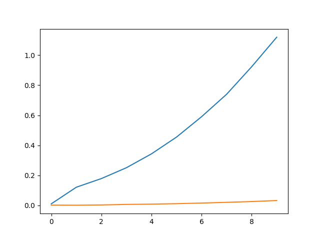

# Метод Якоби 
## Задание:
Сравнить решение СЛАУ методом Якоби со встроенной функцией scipy.linalg.solve на случайной матрице с диагональным преобладанием 
размером 100х100, 200х200 и т.д. Провести несколько экспериментов, пока время счета меньше 1 сек. Построить графики зависимостей.
  
## Что выводит программа?  
Для n = 100 ||x - x_compare|| =  0.07310220598666793  
Для n = 200 ||x - x_compare|| =  0.05438767505006532  
Для n = 300 ||x - x_compare|| =  0.044271700594221815  
Для n = 400 ||x - x_compare|| =  0.03809094557156844  
Для n = 500 ||x - x_compare|| =  0.03370889355934737  
Для n = 600 ||x - x_compare|| =  0.03157379113444858  
Для n = 700 ||x - x_compare|| =  0.029244716993444466  
Для n = 800 ||x - x_compare|| =  0.026679727095607647  
Для n = 900 ||x - x_compare|| =  0.02569076710009136  
Для n = 1000 ||x - x_compare|| =  0.024172123727443064  
1 : Время для метода Зейделя =  0.010891199111938477 | Время scipy.linalg.solve = 0.0029218196868896484  
2 : Время для метода Зейделя =  0.1339585781097412 | Время scipy.linalg.solve = 0.001287221908569336  
3 : Время для метода Зейделя =  0.18313217163085938 | Время scipy.linalg.solve = 0.002950906753540039  
4 : Время для метода Зейделя =  0.2522451877593994 | Время scipy.linalg.solve = 0.005251169204711914  
5 : Время для метода Зейделя =  0.34075284004211426 | Время scipy.linalg.solve = 0.009032249450683594  
6 : Время для метода Зейделя =  0.4549829959869385 | Время scipy.linalg.solve = 0.011595487594604492  
7 : Время для метода Зейделя =  0.5903396606445312 | Время scipy.linalg.solve = 0.015600204467773438  
8 : Время для метода Зейделя =  0.7451934814453125 | Время scipy.linalg.solve = 0.02021503448486328  
9 : Время для метода Зейделя =  0.9300405979156494 | Время scipy.linalg.solve = 0.027575254440307617  
10 : Время для метода Зейделя =  1.1220722198486328 | Время scipy.linalg.solve = 0.03816819190979004  
###График:

